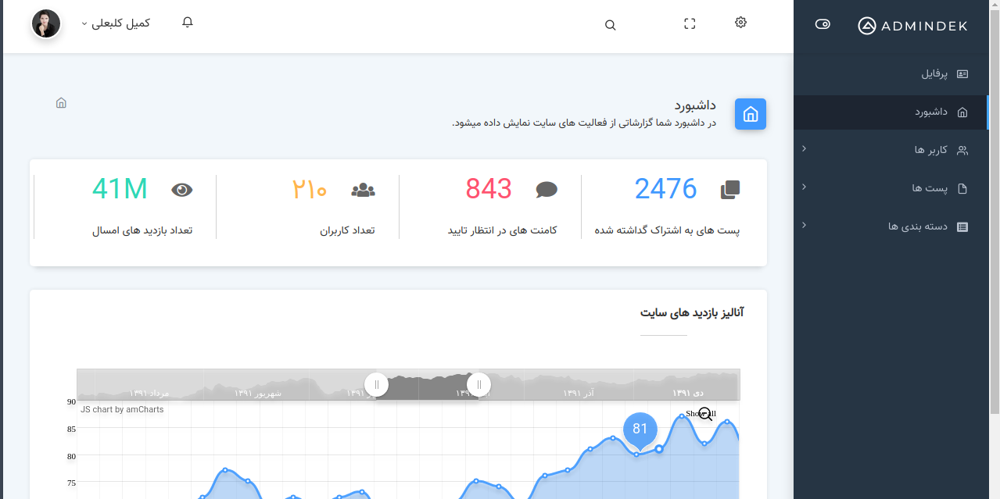

# Laravel-dashboard                                داشبورد لاراول
>Basic laravel dashboard for speed projects.        یک داشبورد ساده برای افزایش سرعت برنامه نویسی

[]
(https://packagist.org/packages/komeyl/dashboard)

[](https://packagist.org/packages/komeyl/dashboard)
[](https://packagist.org/packages/komeyl/dashboard)
[](https://packagist.org/packages/komeyl/dashboard)




## Installation

```
composer require komeyl/dashboard
```

```json
{
    "require": {
        "komeyl/dashboard": "dev-master"
    }
}
```


## Usage example
### just Enter example.com/dashboard 

publishes views

```
php artisan vendor:publish --tag=views --force
```

publishes assets

```
php artisan vendor:publish --tag=public --force
```

publishes translate

```
php artisan vendor:publish --tag=translate --force
```

publishes controllers

```
php artisan vendor:publish --tag=controllers --force
```

_For more examples and usage, please refer to the wiki._


## Meta

Komeyl Kalbali  –  komeyl.kalbali.dev@gmail.com

[https://github.com/Komeyl-dev](https://github.com/Komeyl-dev)
